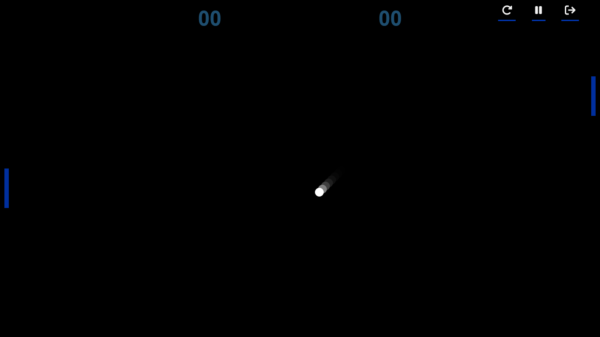

<h1 align="center">Pong Game</h1>

<p align="center">
  A classic web-based Pong game implemented with HTML, CSS, and JavaScript.
</p>

<p align="center">
  <a href="https://raj-kashyap001.github.io/Pong-Game/"><strong>Play the Game</strong></a>
</p>

Pong Game Screenshot 

## Table of Contents

- [About the Project](#about-the-project)
  - [Built With](#built-with)
- [Getting Started](#getting-started)
  - [Prerequisites](#prerequisites)
  - [Installation](#installation)
- [How to Play](#how-to-play)
- [Controls](#controls)
- [Game Features](#game-features)
- [Sound Effects](#sound-effects)
- [Contributing](#contributing)
- [License](#license)

## About the Project

Pong Game is a web-based implementation of the classic Pong arcade game. It provides a simple and enjoyable gaming experience where you can test your reflexes by bouncing a ball back and forth between two paddles.

### Built With

- HTML
- CSS
- JavaScript

## Getting Started

### Prerequisites

To run this game locally, you need a modern web browser.

### Installation

1. Clone the repository
   ```sh
   git clone https://github.com/Raj-Kashyap001/Pong-Game.git
Open index.html in your web browser.

Enjoy playing Pong!

How to Play
Pong is a two-player game, where you control one paddle and the computer controls the other. The objective is simple: score points by making the ball pass your opponent's paddle.

Controls
Use the ArrowUp and ArrowDown keys to move your paddle up and down.
On mobile devices, you can use on-screen touch controls to move your paddle.
Use the Pause button to pause the game and Resume to continue playing.
Click the Reset button to start a new game.
Game Features
Realistic ball physics.
Responsive design for desktop and mobile play.
Score tracking for both players.
Pause and resume functionality.
A restart button for starting a new game.
Sound Effects
The game includes sound effects for user interactions, such as clicking the "Start" button and paddle-ball collisions. Additionally, a "woosh" sound plays when the ball goes off the boundary. These sound effects enhance the gaming experience and can be customized by replacing the sound files in the sounds folder.

Contributing
Contributions are what make the open-source community such a fantastic place to learn, inspire, and create. Any contributions you make are greatly appreciated.

Fork the Project.
Create your Feature Branch (git checkout -b feature/AmazingFeature).
Commit your Changes (git commit -m 'Add some AmazingFeature').
Push to the Branch (git push origin feature/AmazingFeature).
Open a Pull Request.
License
Distributed under the MIT License. See LICENSE for more information.


